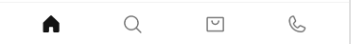

# SneakUp 👟

## 📄 Project Description

**SneakUp** is a full-stack e-commerce web application for sneaker lovers. It allows users to browse, search, and purchase limited-edition footwear and apparel. It features a secure checkout process, dynamic product listings, account management, and admin product control. The project showcases strong UX planning across the Five Planes of UX and a mobile-first, responsive design.

---


---


# SneakUp Mockup Documentation

This documentation shows each page’s **desktop** and **mobile** designs for the SneakUp e-commerce platform.

---

## 🏠 Home Page

**Desktop View**  
[](documentation/mockups/desktop_mockups/desktop_home.png)  


**Mobile View**  
[](documentation/mockups/mobile_mockups/mobile_home.png)  


---

## 🛍️ Product Listing Page

**Desktop View**  
[](documentation/mockups/desktop_mockups/desktop_product_listing.png)  


**Mobile View**  
[](documentation/mockups/mobile_mockups/mobile_product_listing.png)  


---

## 👟 Product Detail Page

**Desktop View**  
[](documentation/mockups/desktop_mockups/desktop_product_detail.png)  


**Mobile View**  
[](documentation/mockups/mobile_mockups/mobileproduct_detail.png)  


---

## 🧺 Shopping Bag Page

**Desktop View**  
[](documentation/mockups/desktop_mockups/desktop_shopping_bag.png)  


**Mobile View**  
[](documentation/mockups/mobile_mockups/mobile_shopping_bag.png)  


---

## 💳 Checkout Page

**Desktop View**  
[](documentation/mockups/desktop_mockups/desktop_checkout_page.png)  


**Mobile View**  
[](documentation/mockups/mobile_mockups/mobile_checkout_page.png)  


---

## ✅ Order Confirmation Page

**Desktop View**  
[](documentation/mockups/desktop_mockups/desktop_order_confirmation_page.png)  


**Mobile View**  
[](documentation/mockups/mobile_mockups/mobile_order_confirmation_page.png)  


---

## 👤 Profile Page

**Desktop View**  
[](documentation/mockups/desktop_mockups/desktop_profile_page.png)  


**Mobile View**  
[](documentation/mockups/mobile_mockups/mobile_profile_page.png)  


---

## 🔐 Login Page

**Desktop View**  
[](documentation/mockups/desktop_mockups/desktop_login.png)  


**Mobile View**  
[](documentation/mockups/mobile_mockups/mobile_login.png)  


---

## ✍️ Sign Up Page

**Desktop View**  
[](documentation/mockups/desktop_mockups/desktop_sign_up.png)  


**Mobile View**  
[](documentation/mockups/mobile_mockups/mobile_sign_up.png)  


---

## ℹ️ About Page

**Desktop View**  
[](documentation/mockups/desktop_mockups/desktop_about_page.png)  


**Mobile View**  
[](documentation/mockups/mobile_mockups/mobile_about_page.png)  


---

## 📞 Contact Page

**Desktop View**  
[](documentation/mockups/desktop_mockups/desktop_contact_page.png)  


**Mobile View**  
[](documentation/mockups/mobile_mockups/mobile_contact_us_page.png)  


---

## 🧑‍💼 Product Management (Admin Only)

**Desktop View**  
[](documentation/mockups/desktop_mockups/desktop_product_management.png)  


**Mobile View**  
[](documentation/mockups/mobile_mockups/mobile_product_management.png)  


---

## 🧭 Header Navigation

**Desktop – User Header**  
[](documentation/mockups/desktop_mockups/desktop_header_user.png)  


**Desktop – Admin Header**  
[](documentation/mockups/desktop_mockups/desktop_header_admin.png)  


**Mobile – Top Navigation**  
[](documentation/mockups/mobile_mockups/mobile_top_nav.png)  


**Mobile – User Sidebar Nav**  
[](documentation/mockups/mobile_mockups/mobile_navigation_sidebar_user.png)  


**Mobile – Admin Sidebar Nav**  
[](documentation/mockups/mobile_mockups/mobile_navigation_sidebar_admin.png)  


---

## 🔻 Footer

**Desktop View**  
[](documentation/mockups/desktop_mockups/desktop_footer.png)  


**Mobile View**  
[](documentation/mockups/mobile_mockups/mobile_footer.png)  


---

## 📱 Mobile Only – Bottom Navigation

**Mobile Bottom Nav**  
[](documentation/mockups/mobile_mockups/mobile_bottom_nav.png)  



## 🧠 UX Design – The Five Planes

### 1. Strategy Plane

- **Purpose**: Build a user-focused online shop for streetwear sneakers and apparel.
- **Business Goal**: Provide an intuitive, stylish shopping experience to drive conversions and build brand loyalty.

### 2. Scope Plane

- **User Features**:
  - Browse, filter, and search sneakers.
  - Add items to shopping bag.
  - Checkout securely with Stripe.
  - View order confirmation and history.

- **Admin Features**:
  - CRUD operations for products.
  - Access order and customer info.

### 3. Structure Plane

- **Navigation**:
  - Primary nav: Home, Shop, About, Bag, Profile.
  - Burger nav on mobile.

- **User Flow**:
  - Register → Browse → Add to Bag → Checkout → Confirmation

### 4. Skeleton Plane

- **Layout**:
  - Two-column layout for checkout.
  - Card-style product listings.

- **Interactions**:
  - Toasts for bag updates and errors.
  - Responsive mobile header with slide-in nav.

### 5. Surface Plane

- **Fonts**: Bebas Neue, Barlow, Open Sans.
- **Colors**:
  - Primary: #000000 (Black)
  - Secondary: #ffffff (White)
  - Accent: #ff0000 (Red)
- **Visual Identity**: Bold, urban, minimal.

---

## 👥 User Stories

| ID | Title             | As a...   | I want to...                | So that...                     |
|----|-------------------|-----------|-----------------------------|--------------------------------|
| 1  | Browse Products   | Shopper   | view a list of products     | I can find items I like        |
| 2  | Filter by Size    | Shopper   | filter shoes by size        | I only see what fits me        |
| 3  | Add to Bag        | Shopper   | add products to my bag      | I can purchase them later      |
| 4  | Edit Cart         | Shopper   | remove or change items      | I can manage my purchase       |
| 5  | Checkout          | Shopper   | securely pay for my order   | I can complete my transaction  |
| 6  | View Orders       | Shopper   | view my order history       | I can track past purchases     |
| 7  | Manage Products   | Admin     | add/edit/delete products    | I can manage the catalog       |
| 8  | Secure Access     | Admin     | access admin-only views     | my data is protected           |

---

## ✨ Features

### Core Features

- Account registration & login
- Responsive product listing
- Add to shopping bag
- Stripe payment integration
- Order history and confirmation
- Admin dashboard for product management

### Future Enhancements

- Wishlist/favorites system
- Reviews and ratings
- Inventory alerts
- Mobile app with React Native
- AI-based product recommendations

---

## 🛠️ Tools & Technologies


---

## 🧬 Database Design


---

## 🧑‍💻 Agile Development & Process

### MoSCoW Prioritization

- **Must**: Add to cart, checkout, register/login
- **Should**: Filter/search, responsive layout
- **Could**: Wishlists, user reviews
- **Won’t Yet**: Live chat, international shipping

### GitHub Project Board

Tasks are tracked using:
- Epics
- Issues
- Milestones
- Labels (e.g., `bug`, `enhancement`, `UI`)

---

## ✅ Testing

Please refer to the [TESTING.md](TESTING.md) file for:

- Manual testing (desktop & mobile)
- Automated test coverage
- Stripe integration test cases
- Form validation feedback
- Toast message display
- Accessibility testing

---

## 🚀 Deployment

### Live Site

[SneakUp on Heroku](https://your-sneakup-project.herokuapp.com)

### Key Steps:

- PostgreSQL setup via Heroku
- Cloudinary for media storage
- Static files served via WhiteNoise
- Environment variables managed with `.env`
- Production build using `collectstatic`

### Local Development

```bash
git clone https://github.com/your-username/sneakup.git
cd sneakup
pip install -r requirements.txt
python manage.py runserver
