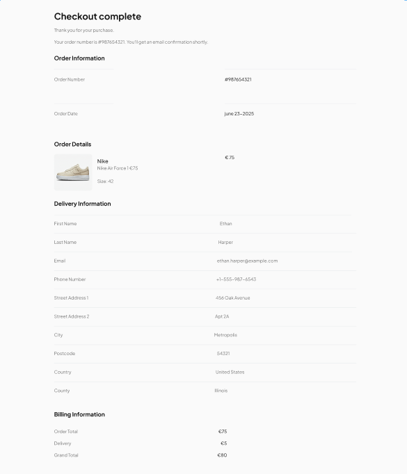
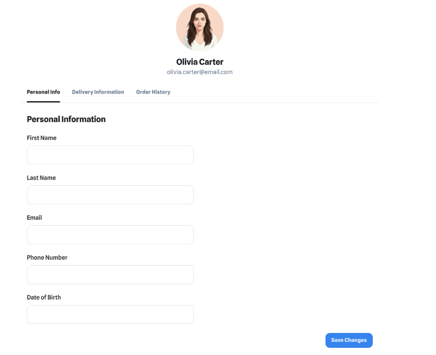
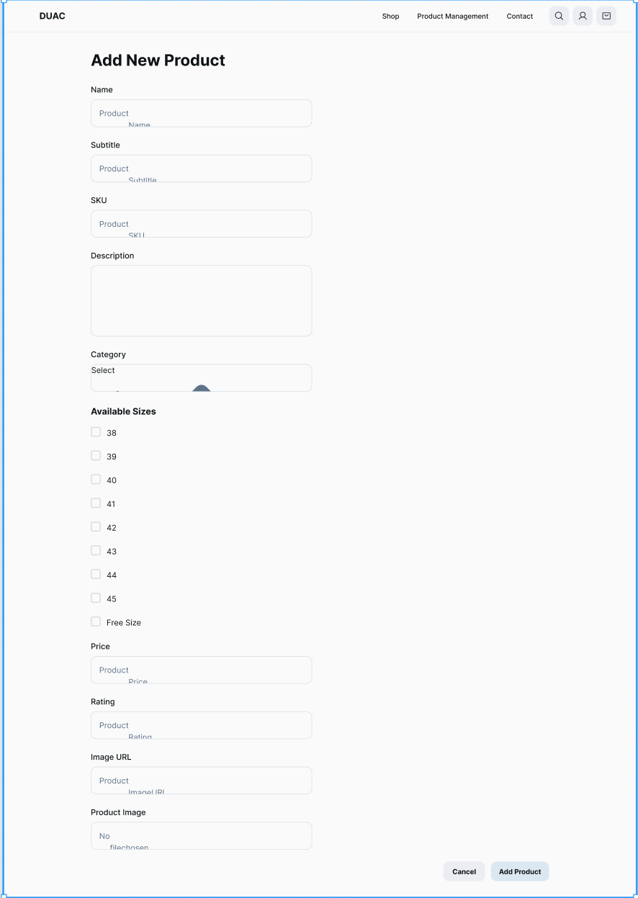

# SneakUp 👟

## 📄 Project Description

**SneakUp** is a full-stack e-commerce web application for sneaker lovers. It allows users to browse, search, and purchase limited-edition footwear and apparel. It features a secure checkout process, dynamic product listings, account management, and admin product control. The project showcases strong UX planning across the Five Planes of UX and a mobile-first, responsive design.

---


---


# SneakUp Mockup Documentation

This documentation shows each page’s **desktop** and **mobile** designs for the SneakUp e-commerce platform.

---

## 🏠 Home Page

| Desktop Version | Mobile Version |
|-----------------|----------------|
|  |  |

### 🔍 Purpose
The Home Page introduces the user to the DUAC brand and showcases featured shoe categories like **Running**, **Casual**, **Formal**, and **Sports**. It includes promotional banners and a newsletter subscription section to drive engagement.

### ✨ Features
- **Hero Banner** with call-to-action button.
- **Featured Categories** section with clickable images.
- **Seasonal Promotion Banner** (e.g. Summer Sale).
- **Newsletter Subscription Form**.
- **Free Delivery Promo Box**.

### ⚙️ Backend Integration
- Loads product category images dynamically from media.
- Displays a dynamic welcome message based on category availability.
- Stores and validates newsletter email submissions using the `NewsletterSubscriber` model.

### ✅ Works As Expected
- Fully responsive and styled using Bootstrap.
- Desktop and mobile versions display properly.
- Email subscription uses Django validation and gives real-time user feedback.


## 🛍️ Product Listing Page

| Desktop Version | Mobile Version |
|-----------------|----------------|
|  |  |

### 🔍 Purpose
The Product Listing Page displays all available shoes in the SneakUp store. It allows users to browse by category, filter and sort products, and preview key details before visiting the product detail page.

### ✨ Features
- **Marketing Banner** at the top with promotional text and background.
- **Category Filter Sidebar** for browsing by shoe type (e.g., Casual, Running).
- **Sorting Options** (e.g., Price Low to High, Rating).
- **Product Cards** with:
  - Image
  - Name and Price
  - Star Ratings
- **Admin Controls** (Edit/Delete) visible only to staff users.
- **Scroll to Top Button** for quick navigation.

### ⚙️ Backend Integration
- Product and category data fetched from Django models using:
  ```python
  products = Product.objects.all()
  categories = Category.objects.all()
  ```
- Filtering, sorting, and query parameters handled in the `all_products_view`.
- Star ratings rendered using custom template logic or static icons.
- Dynamic images via Cloudinary or uploaded media.
- Admin-only buttons shown conditionally with:
  ```django
  
    <!-- Edit/Delete Buttons -->
  
  ```

### ✅ Works As Expected
- Fully responsive with Bootstrap layout.
- Sidebar hides on mobile; sorting appears above products.
- All links and filters work correctly.
- Admin tools are restricted and tested.


## 📦 Product Detail Page

| Desktop Version | Mobile Version |
|-----------------|----------------|
|  |  |

### 🔍 Purpose
The Product Detail Page provides comprehensive information about a specific shoe product. It allows customers to view product images, detailed descriptions, ratings, and select sizes and quantities before adding items to their shopping bag.

### ✨ Features
- **Breadcrumb Navigation** for easy backtracking.
- **Product Information** including name, subtitle, price, description, and category links.
- **Product Image** with fallback to default if no image exists.
- **Star Ratings** displayed visually with icons.
- **Size Selection** with free-size or selectable sizes.
- **Quantity Selector** with increment/decrement buttons.
- **Add to Bag Form** with hidden fields to handle size, quantity, and redirect.
- **Admin Controls** for editing or deleting the product (visible to staff only).
- **Shipping Info Cards** detailing fast delivery, free returns, and resell options.
- **Keep Shopping Button** for easy navigation back to product listings.

### ⚙️ Backend Integration
- Product data fetched by `product_detail` view via product ID.
- Size options dynamically rendered based on product attributes.
- Admin controls shown conditionally using:
  ```django
  
    <!-- Edit/Delete Buttons -->
  


## 🛒 Shopping Bag Page

| Desktop Version | Mobile Version |
|-----------------|----------------|
|  |  |

### 🔍 Purpose
The Shopping Bag Page allows users to review their selected products before checkout. Users can see product details, modify quantities and sizes, view delivery info, and proceed to payment.

### ✨ Features
- **List of Products** with images, name, selected size, and quantity.
- **Quantity Update Controls** with increment/decrement functionality.
- **Dynamic Messages** prompting users to sign up/login for free delivery.
- **Order Summary** showing subtotal, delivery cost, VAT, and total.
- **Checkout Button** directs users to the checkout page.
- **Empty Bag State** with a prompt to keep shopping.

### ⚙️ Backend Integration
- Bag data stored in session and updated via `add_to_bag` and `update_bag` views.
- Product quantities validated (1-10) before adding to bag.
- Handles products with and without size options, storing sizes as nested dict entries.
- Updates or removes items from the bag dynamically with user feedback via Django messages.
- Redirects users back to previous page after adding or updating items.
- Uses Django’s `get_object_or_404` for robust product retrieval.
- Includes partial templates for quantity update controls for reuse.

### ✅ Works As Expected
- Responsive design with Bootstrap, visually consistent on desktop and mobile.
- Clear user feedback on quantity changes and bag updates.
- Dynamic free delivery messaging based on current order total.
- Seamless integration between session storage and frontend display.
- Robust handling of edge cases like zero quantity or missing sizes.


## 🛒 Checkout Page

| Desktop Version | Mobile Version |
|-----------------|----------------|
|  |  |

### 🔍 Purpose
The Checkout Page allows customers to securely provide their shipping and payment details to complete a purchase. It also displays a detailed order summary with itemized pricing, VAT, and delivery costs.

### ✨ Features
- **User Details & Shipping Form:** Collects first name, last name, email, phone number, and full address.
- **Save Info Option:** Lets authenticated users save shipping info to their profile.
- **Stripe Payment Fields:** Secure card input fields (card number, expiry, CVC) via Stripe Elements.
- **Order Summary:** Lists items with quantity, size, subtotal, VAT, delivery, and grand total.
- **Profile Mode:** Displays order details without payment fields when accessed from user profile.
- **Navigation Buttons:** Adjust bag, return to profile, or go back to shopping.

### ⚙️ Backend Integration
- Handled by the `checkout` view in Django.
- On **GET**:
  - Retrieves bag from session.
  - Creates Stripe PaymentIntent for order total.
  - Pre-fills form with user profile info if authenticated.
- On **POST**:
  - Validates submitted order form.
  - Saves Order and OrderLineItems for both free-size and sized products.
  - Associates Stripe payment ID (`stripe_pid`) with the order.
  - Redirects to the `checkout_success` page upon success.
- Uses `OrderForm` and crispy-forms for clean form rendering.

### 🛠️ Frontend Integration (JavaScript)
- Loads Stripe public key and client secret securely.
- Creates Stripe Elements for card number, expiry, and CVC with custom styling.
- Displays inline validation errors for each card input field.
- On form submission:
  - Disables inputs and submit button.
  - Sends AJAX POST to cache checkout data.
  - Calls `stripe.confirmCardPayment` to process payment.
  - Handles payment success by submitting the form.
  - Shows error messages and re-enables inputs on failure.

## 📦 Order Confirmation Page

| Desktop Version | Mobile Version |
|-----------------|----------------|
|  |  |

### 🔍 Purpose
The Order Confirmation Page shows a detailed summary of a completed order. It confirms the purchase, displays order number, items purchased, shipping and billing information, and encourages customers to continue shopping.

### ✨ Features
- **Order Summary** with product images, names, subtitles, quantities, and sizes.
- **Shipping Details** including name, email, phone, full address, and optional fields.
- **Billing Information** showing order total, delivery cost, and grand total.
- **Responsive Layout** adapting details view for desktop and mobile.
- **Post-Purchase Marketing Section** with a thank you message and a call-to-action button to continue shopping.

### ⚙️ Backend Integration
- Order retrieved by `order_number` from URL.
- Links order to authenticated user’s profile and optionally saves shipping info.
- Clears shopping bag data from the session on success.
- Displays success message with order number and confirmation email.

## 👤 Profile Page

| Desktop Version | Mobile Version |
|-----------------|----------------|
|  |  |

### 🔍 Purpose
The Profile Page allows users who are logged in to manage their personal account details, delivery information, and view their order history all in one place. Users can update their delivery address, verify email settings, and access detailed order information.

### ✨ Features
- **Personal Info Tab:** Displays username and email with a welcome message.
- **Delivery Information Tab:** Editable delivery address form powered by a Django ModelForm with Crispy Forms.
- **Order History Tab:** Table listing past orders with order number, date, total, and link to detailed order view.
- **Tabbed Interface:** Bootstrap nav-tabs for smooth tab switching.
- **Email Verification Badge:** Shows email verification status with a quick link to email settings.
- **Buttons and Links:** Back to home and view order details.
- **Responsive Layout:** Uses Bootstrap grid and utility classes.
- **Custom CSS and JS:** Includes `profile.css` and `profile.js` for styling and interactivity.

### ⚙️ Backend Integration
- This page requires the user to be logged in.
- Fetches the logged-in user’s Profile model instance.
- Passes `profile_form` (a Django ModelForm for Profile) and `orders` queryset into the template context.
- Handles form submission via POST to update profile delivery information.
- Orders are linked through the `profile.orders.all()` reverse relation.
- Order detail links route to an order detail view for inspecting individual orders.


## 🔐 Login Page

| Desktop Version | Mobile Version |
|-----------------|----------------|
|  |  |

### 🔍 Purpose
The Login Page allows existing users to authenticate and access their accounts securely.

### ✨ Features
- Customized Django authentication login template.
- Includes fields for username/email and password.
- "Remember Me" option to maintain login session.
- Links to password reset and sign up pages.
- Responsive design using Bootstrap for desktop and mobile.
- Custom CSS styling to match site branding.

### ⚙️ Backend Integration
- Uses Django’s built-in authentication backend.
- Form submission posts to the standard Django login view.
- Displays error messages for invalid login attempts.
- Redirects authenticated users to their profile or previous page.

---

## ✍️ Sign Up Page

| Desktop Version | Mobile Version |
|-----------------|----------------|
|  |  |

### 🔍 Purpose
The Sign Up Page enables new users to create an account by providing required registration details.

### ✨ Features
- Customized Django user registration template.
- Includes fields for username, email, password, and password confirmation.
- Validates user inputs with clear error messages.
- Responsive layout styled with Bootstrap.
- Custom branding and styling consistent with the rest of the site.

### ⚙️ Backend Integration
- Connects to a Django registration view handling user creation.
- On successful registration, users may be redirected to login or automatically logged in.
- Uses Django forms for validation and user model creation.
- Includes CSRF protection and security best practices.


## 📝 About Page

| Desktop Version | Mobile Version |
|-----------------|----------------|
|  |   |

### 🔍 Purpose
The About Page provides visitors with detailed information about DUAC’s brand story, mission, latest arrivals, best-selling products, materials used, and recent product launches. It is designed to build trust and engagement by showcasing the company’s values and product highlights.

### ✨ Features
- **Hero Section** with a large background image and overlay title.
- **Our Mission** section describing the brand’s vision and goals.
- **New Arrivals** grid showcasing the latest footwear products.
- **Our Materials** section explaining the sustainable or quality materials used.
- **Best Selling** highlight with text and image, including a shop button.
- **Launched Products** featuring products launched in the last 3 years.

### ⚙️ Backend Integration

- Data for each section is managed via Django models and can be updated through the Django Admin interface.
- The template uses conditional rendering: each section only appears if its corresponding model instance or queryset is available.
- Product images and details are fetched dynamically from related models.
- Example usage in the view:

## 📞 Contact Page

| Desktop Version | Mobile Version |
|-----------------|----------------|
|  |  |

### 🔍 Purpose
The Contact Page enables users to get in touch with DUAC by submitting inquiries via a contact form or by using the provided contact information. It facilitates customer support and communication.

### ✨ Features
- **Contact Form** where users can enter their name, email, subject, and message.
- **Form Validation** to ensure all required fields are filled and email format is correct.
- **Submission Feedback** with success or error messages after form submission.
- **Display of Contact Information** including phone number, email, and physical address for alternative contact methods.
- **Responsive Layout** optimized for desktop and mobile devices.


## 🧑‍💼 Product Management (Admin Only)

**Desktop View**  
[](documentation/mockups/desktop_mockups/desktop_product_management.png)  


**Mobile View**  
[](documentation/mockups/mobile_mockups/mobile_product_management.png)  


---

## 🧭 Header Navigation

The header navigation across DUAC uses the `base.html` template as its foundation. It dynamically adapts based on user authentication and device viewport, providing seamless navigation for both regular users and admin staff.

### Desktop – User Header  
- Displays the DUAC logo linked to the homepage.
- Main navigation includes links to Shop, About, Contact, and user profile dropdown.
- Shows shopping bag icon with dynamic cart total.
- User profile dropdown offers links to profile and logout for logged-in users; otherwise, links to login and signup.


### Desktop – Admin Header  
- Includes additional navigation links for admin features such as Product Management.
- Maintains user profile dropdown and shopping bag functionality.


### Mobile – Top Navigation  
- Hamburger menu icon triggers mobile navigation sidebar.
- Logo and essential navigation links remain visible.
- Includes search toggle and user profile dropdown as icons.


### Mobile – User Sidebar Nav  
- Sidebar navigation slides in on mobile devices for logged-in users.
- Contains main navigation links optimized for mobile screen.
- Provides quick access to profile and logout.


### Mobile – Admin Sidebar Nav  
- Sidebar navigation for admin users on mobile devices.
- Includes admin-specific links like Product Management along with regular navigation.


---

## 🔻 Footer

The footer is consistent across pages and responsive, included in the `base.html` template:

- Contains site navigation links: About, Contact, Privacy Policy, Returns, and FAQs.
- Displays social media icons linking to official DUAC channels.
- Shows current year and company name copyright.

### Desktop View  


### Mobile View  


---

### Notes on `base.html` Integration

- The base template contains the HTML structure and loads CSS/JS libraries needed for responsive behavior.
- Navigation menus and footer are embedded within the base template using Django templating language.
- User-specific content such as profile links and admin features are conditionally rendered based on `user.is_authenticated` and `user.is_staff`.
- Mobile and desktop views adapt automatically via Bootstrap's responsive classes and custom JavaScript interactions included in the base template.

This ensures all header and footer components remain consistent and maintain functionality across all pages and device sizes.

## 🧠 UX Design – The Five Planes

### 1. Strategy Plane

- **Purpose**: Build a user-focused online shop for streetwear sneakers and apparel.
- **Business Goal**: Provide an intuitive, stylish shopping experience to drive conversions and build brand loyalty.

### 2. Scope Plane

- **User Features**:
  - Browse, filter, and search sneakers.
  - Add items to shopping bag.
  - Checkout securely with Stripe.
  - View order confirmation and history.

- **Admin Features**:
  - CRUD operations for products.
  - Access order and customer info.

### 3. Structure Plane

- **Navigation**:
  - Primary nav: Home, Shop, About, Bag, Profile.
  - Burger nav on mobile.

- **User Flow**:
  - Register → Browse → Add to Bag → Checkout → Confirmation

### 4. Skeleton Plane

- **Layout**:
  - Two-column layout for checkout.
  - Card-style product listings.

- **Interactions**:
  - Toasts for bag updates and errors.
  - Responsive mobile header with slide-in nav.

### 5. Surface Plane

- **Fonts**: Bebas Neue, Barlow, Open Sans.
- **Colors**:
  - Primary: #000000 (Black)
  - Secondary: #ffffff (White)
  - Accent: #ff0000 (Red)
- **Visual Identity**: Bold, urban, minimal.

---

## 👥 User Stories

| ID | Title             | As a...   | I want to...                | So that...                     |
|----|-------------------|-----------|-----------------------------|--------------------------------|
| 1  | Browse Products   | Shopper   | view a list of products     | I can find items I like        |
| 2  | Filter by Size    | Shopper   | filter shoes by size        | I only see what fits me        |
| 3  | Add to Bag        | Shopper   | add products to my bag      | I can purchase them later      |
| 4  | Edit Cart         | Shopper   | remove or change items      | I can manage my purchase       |
| 5  | Checkout          | Shopper   | securely pay for my order   | I can complete my transaction  |
| 6  | View Orders       | Shopper   | view my order history       | I can track past purchases     |
| 7  | Manage Products   | Admin     | add/edit/delete products    | I can manage the catalog       |
| 8  | Secure Access     | Admin     | access admin-only views     | my data is protected           |

---

## ✨ Features

### Core Features

- Account registration & login
- Responsive product listing
- Add to shopping bag
- Stripe payment integration
- Order history and confirmation
- Admin dashboard for product management

### Future Enhancements

- Wishlist/favorites system
- Reviews and ratings
- Inventory alerts
- Mobile app with React Native
- AI-based product recommendations

---

## 🛠️ Tools & Technologies


---

## 🧬 Database Design


---

## 🧑‍💻 Agile Development & Process

### MoSCoW Prioritization

- **Must**: Add to cart, checkout, register/login
- **Should**: Filter/search, responsive layout
- **Could**: Wishlists, user reviews
- **Won’t Yet**: Live chat, international shipping

### GitHub Project Board

Tasks are tracked using:
- Epics
- Issues
- Milestones
- Labels (e.g., `bug`, `enhancement`, `UI`)

---

## ✅ Testing

Please refer to the [TESTING.md](TESTING.md) file for:

- Manual testing (desktop & mobile)
- Automated test coverage
- Stripe integration test cases
- Form validation feedback
- Toast message display
- Accessibility testing

---

## 🚀 Deployment

### Live Site

[SneakUp on Heroku](https://your-sneakup-project.herokuapp.com)

### Key Steps:

- PostgreSQL setup via Heroku
- Cloudinary for media storage
- Static files served via WhiteNoise
- Environment variables managed with `.env`
- Production build using `collectstatic`

### Local Development

```bash
git clone https://github.com/your-username/sneakup.git
cd sneakup
pip install -r requirements.txt
python manage.py runserver
