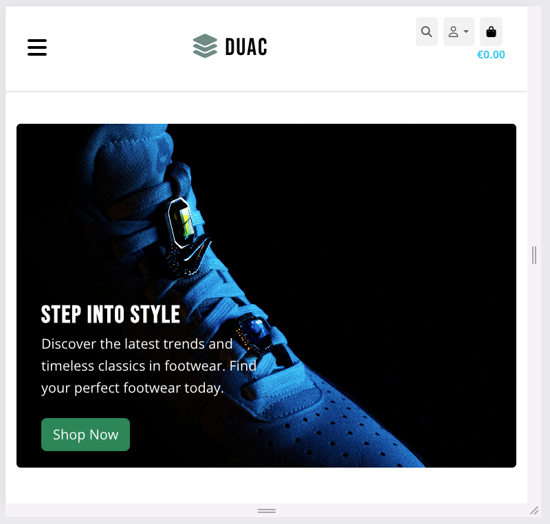
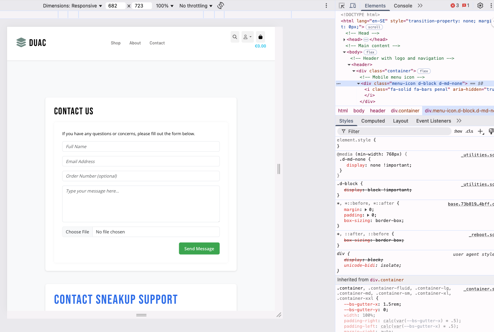
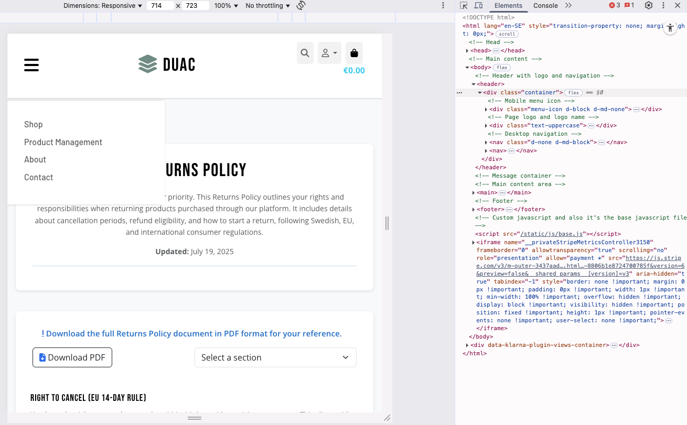

## Manual Testing

All core features of the SneakUp platform were manually tested on multiple devices and browsers to ensure usability, responsiveness, accessibility, and data integrity. The following outlines the manual testing process and outcomes:

### Responsive Layout
| Device | Action | Outcome |
|--------|--------|---------|
| Mobile | Navigated through header links and menus | All links functional; burger menu works as expected |
| Tablet | Browsed product grid | Products resized and aligned correctly |
| Desktop | Resized window and switched pages | Layout adapted properly at all breakpoints |

### Product Features
| Feature | Action | Result |
|--------|--------|--------|
| Product Listing | Visited product page with filters and pagination | Products display and update as expected |
| Product Detail | Clicked on product to view details | Details (price, size, description) loaded correctly |
| Add to Cart | Added item with size (or free size) | Item correctly added with feedback toast |
| Cart Management | Updated, removed items | All cart actions worked, totals updated live |

### Checkout Flow
| Step | Action | Outcome |
|------|--------|---------|
| Guest Checkout | Filled in form and completed payment | Order processed, redirected to success page |
| Logged-in Checkout | Used saved profile data | Form autofilled; user order stored in profile |
| Invalid Card | Entered test invalid details | Stripe blocked submission with error message |
| Order Confirmation | Checked email inbox | Confirmation email received with order summary |

### Authentication & User Profile
| Action | Test | Result |
|--------|------|--------|
| Register | Created new account | Account created, redirected to profile |
| Login / Logout | Logged in/out repeatedly | Sessions maintained correctly |
| Reset Password | Used reset link from email | Password updated successfully |
| Profile Update | Changed name/address | Saved and reflected in checkout and dashboard |
| View Orders | Accessed past orders page | Previous orders listed with full detail view |

### Static / Informational Pages
| Page | Test | Result |
|------|------|--------|
| Returns & Privacy | Viewed and downloaded policies | Pages rendered; download buttons worked |
| About Page | Read history and sections (mission, best sellers, etc.) | Content structured and visible correctly |
| Contact Page | Submitted message via contact form | Success message shown; info not editable |
| FAQs | Read expandable questions | Layout rendered cleanly, mobile-friendly |

### Admin & Management
| Action | Test | Result |
|--------|------|--------|
| Add Product | Added via admin dashboard | Product appeared instantly on front store |
| Delete Product | Tried from product detail & list | Warning prompt shown; product removed |
| Edit Static Page | Modified About/Privacy from admin | Changes reflected dynamically on site |

---

## Manual Testing – Navigation Issue

During manual testing of the website’s navigation responsiveness and behavior across different pages and screen sizes, the following issue and resolution were identified.

### Navigation Visibility Issue

**Observed Behavior:**

 

- On certain pages such as **Home**, **Shop**, and **Product Detail**, the navigation behaved as expected:
  - The **mobile burger icon** appeared on screen widths **under 768px**.
  - The **desktop navigation header** appeared on **768px and above**.
- However, on other pages (e.g., **Contact**, **About**, **Profile** **Returns**, **Privacy Policy**, **Bag** **Checkout** and **FAQs**), the navigation was **hidden by default**, regardless of screen size.

 

**Root Cause:**

- These pages were using custom `` and `` blocks that **overrode** the contents of the base template, specifically:
  - The `<meta>` tags affected mobile navigation visibility.
  - The JavaScript in `postload_js` overrode `base.js`, breaking the burger menu functionality.

---

### Fix Implemented

To solve the problem:

1. **Corrected block tag usage** to extend base content rather than replace it.
2. **Use ``** in Child Templates. Replaced any `` with ``
3. **Ensured all custom blocks use `{{ block.super }}`** to inherit functionality from `base.html`.

#### Example Fix for Meta Tags:

```django

    
    <meta name="robots" content="noindex">



  {{ block.super }}
  <script src=""></script>

```
###  Summart
- After applying these changes, navigation behaves correctly on all pages and across all screen sizes. Manual testing confirmed the fix.

 