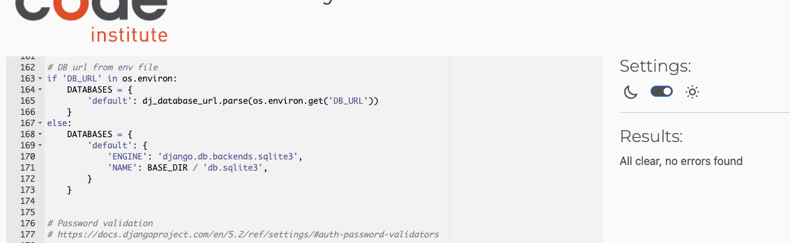
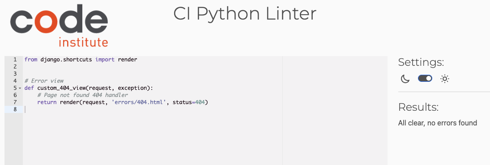
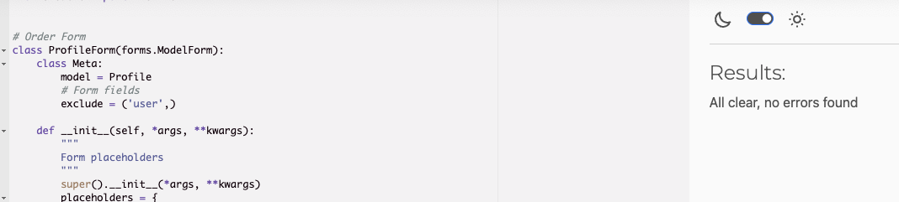
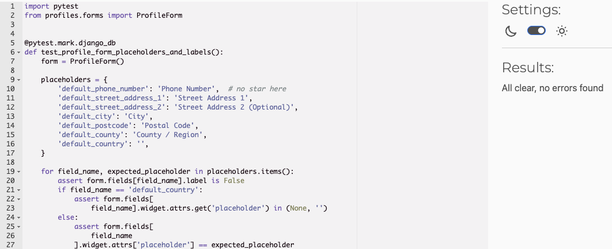

# ✅ PEP 8 Compliance Overview

All key project files were reviewed and fixed for PEP 8 issues
using online tools. Below are the files checked,
cleaned, and passed, with screenshots included. And the file's that is not
included had no issues

---

## Sneakup app

### `sneakup/settings.py`

---

### `sneakup/404/views.py` (404 View)

---

## Profile app

### `profiles/views.py`

---

### `profiles/form.py`

---

### `profiles/form_tests.py`

---