# ✅ PEP 8 Compliance Overview

All key project files were reviewed and fixed for PEP 8 issues
using online tools. Below are the files checked,
cleaned, and passed, with screenshots included. And the file's that is not
included had no issues

---

## Sneakup app

### `sneakup/settings.py`

---

### `sneakup/404/views.py` (404 View)

---

## Profile app

### `profiles/views.py`

---

### `profiles/form.py`

---

### `profiles/form_tests.py`

---

## Products app

### `products/views.py`
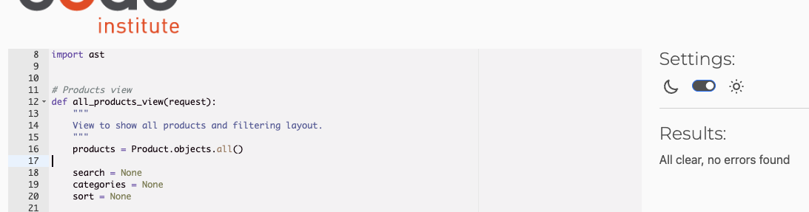

---

### `products/views_tests.py`
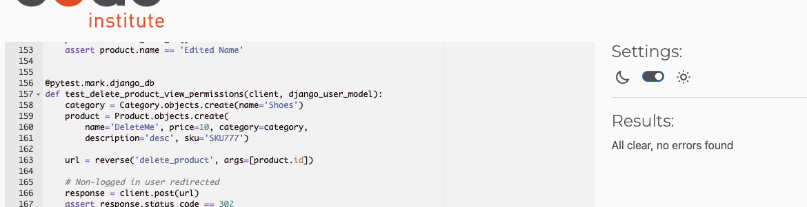

---

### `products/form.py`
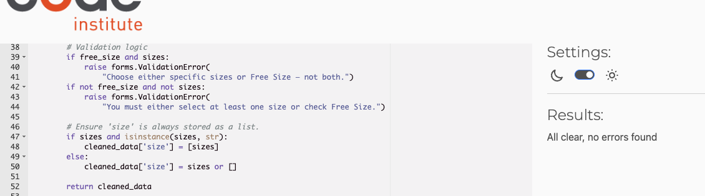

---

### `products/form_tests.py`
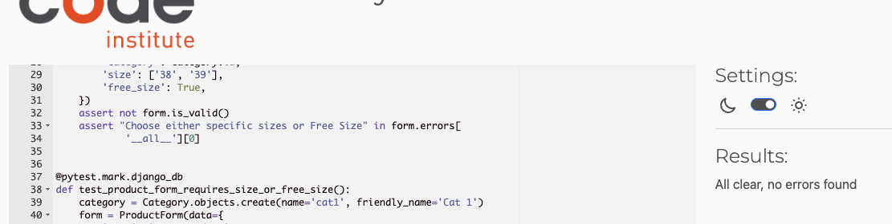

---

### `products/model.py`
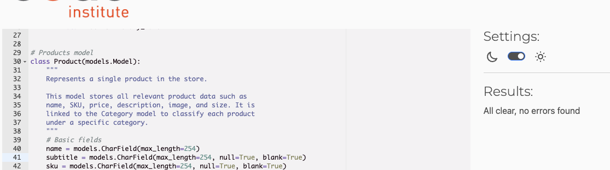

---

### `products/url_tets.py`
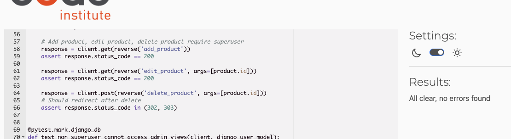

---

## Pages app

### `products/admin.py`
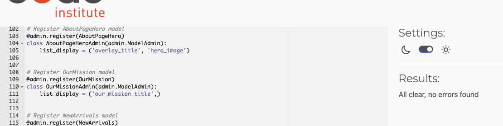

---

### `products/admin_tests.py`
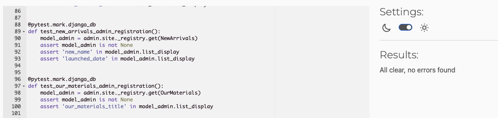

---

### `products/model.py`
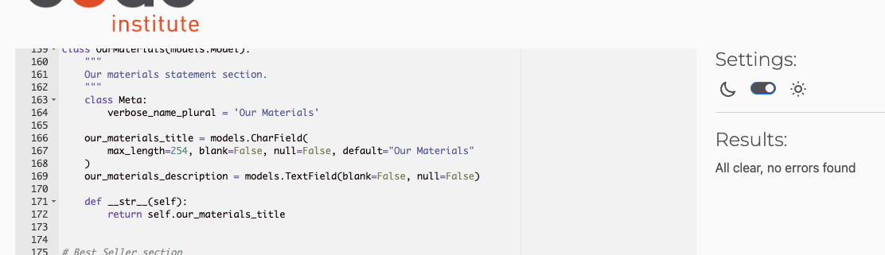

---

### `products/view_tests.py`
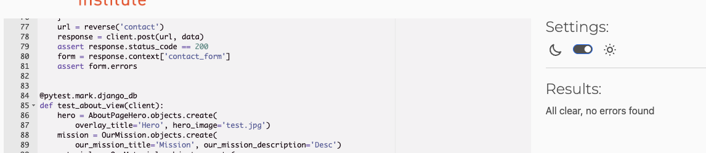

---

## Home app

### `products/view.py`
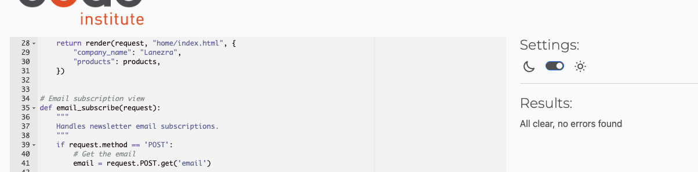

---

### `products/view_tests.py`
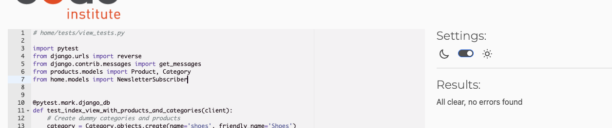

---

## Bag app

### `bag/view.py`
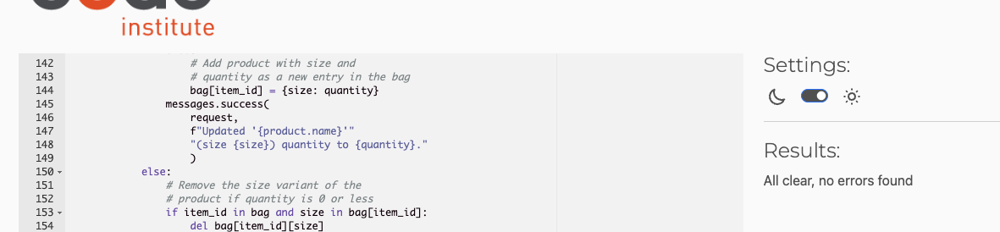

---

### `bag/view_tests.py`
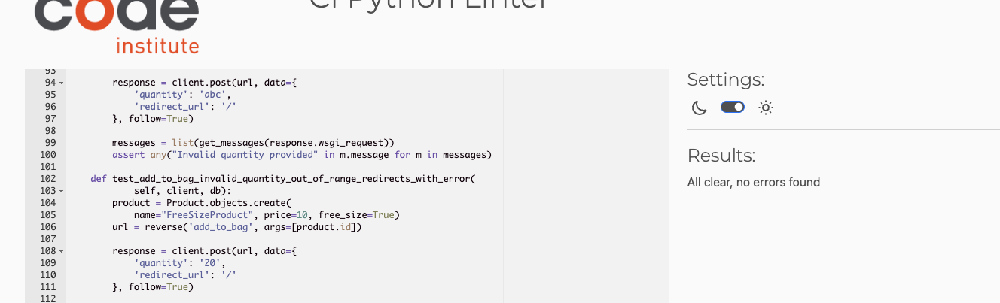

---
### `bag/contents.py`
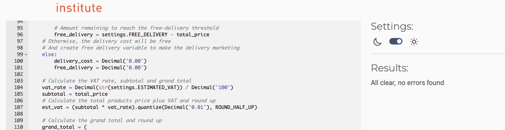

---

## Checkout app

### `checkout/webhooks.py`
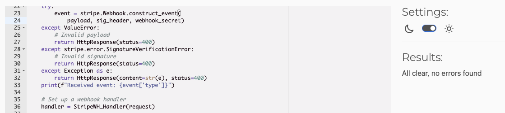

---

### `checkout/webhooks_handler.py`
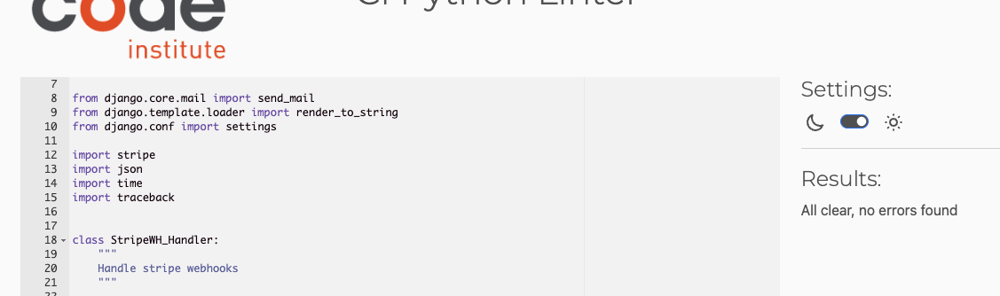
    I Could not fix the street address 1 and 2.
    They are two long when I tried to fix it makes the code worse.

---

### `checkout/webhooks_tests.py`
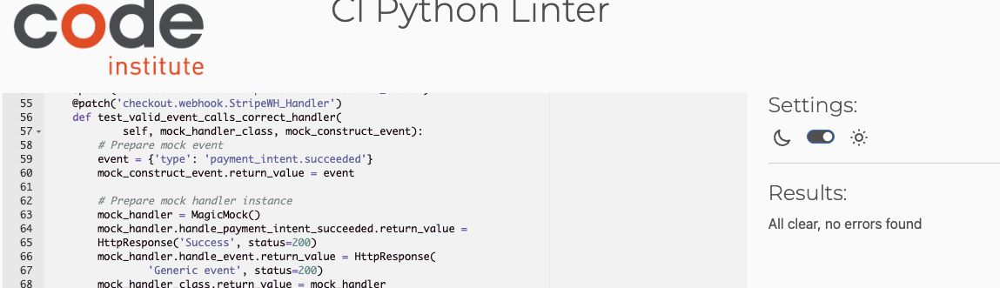

---

### `checkout/view.py`
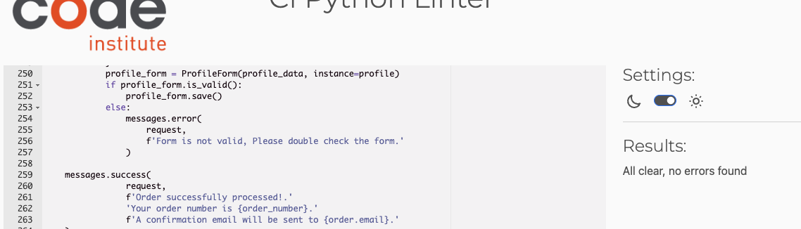

---

### `checkout/view_tests.py`
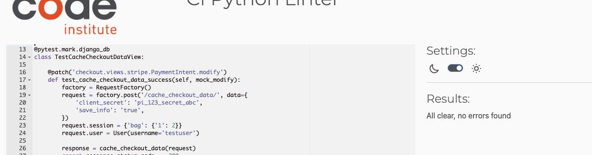

---

### `checkout/model.py`

---

### `checkout/model_tests.py`

---

