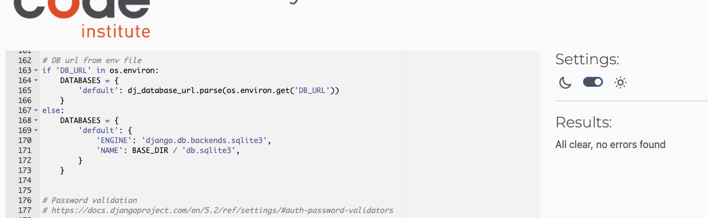
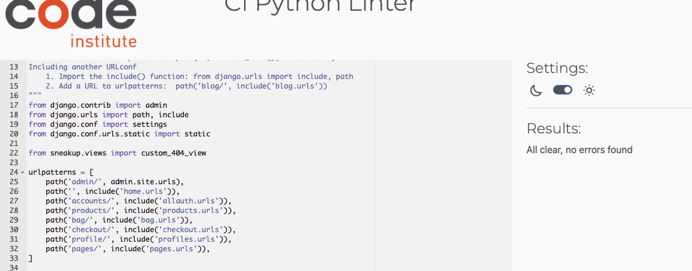
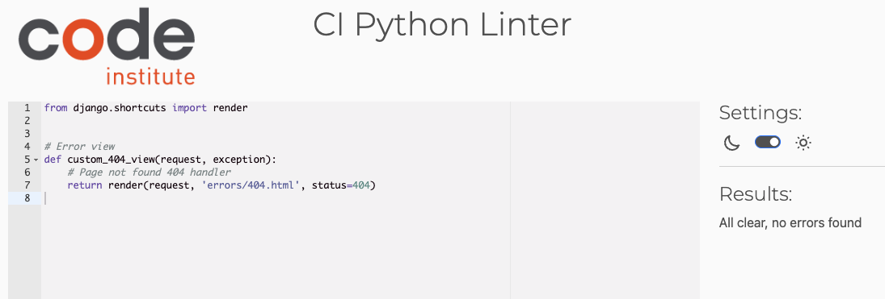
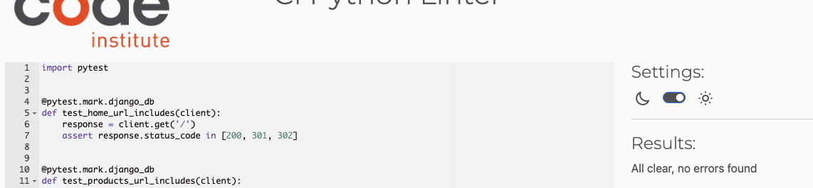
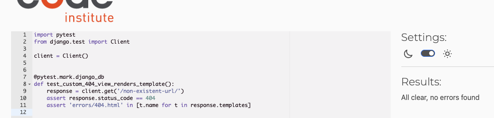

# ✅ PEP 8 Compliance Overview

All key project files were reviewed and fixed for PEP 8 issues
using `flake8` and online tools. Below are the files checked,
cleaned, and passed, with screenshots included.

---

### `sneakup/settings.py`

---

### `sneakup/urls.py`

---

### `sneakup/404/views.py` (404 View)

---

### `tests/project_urls_tests.py`

---

### `tests/404_views_tests.py`

