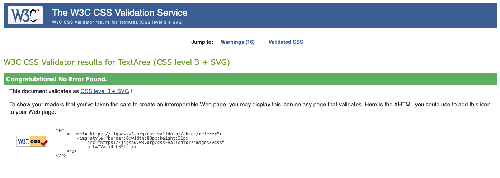
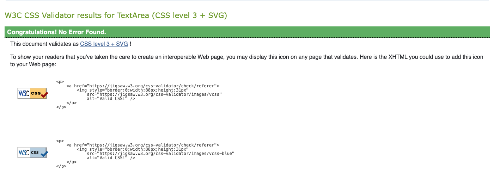
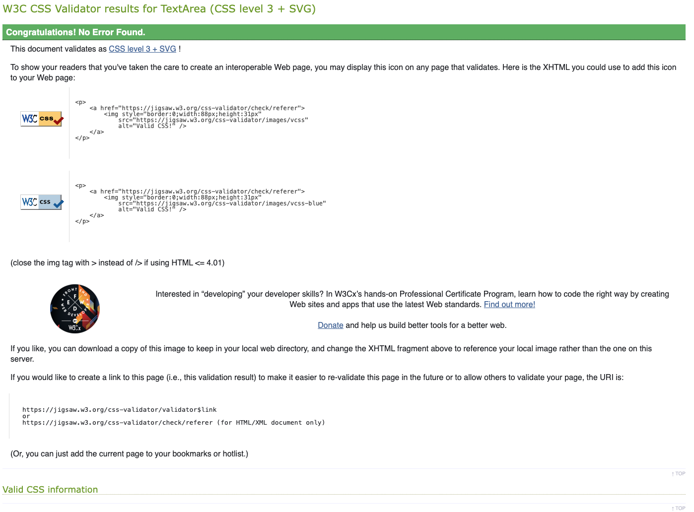
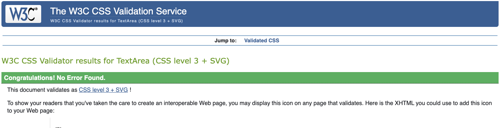
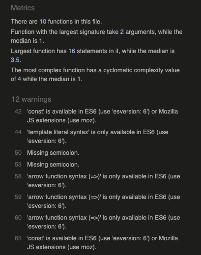
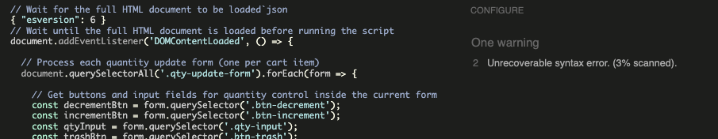
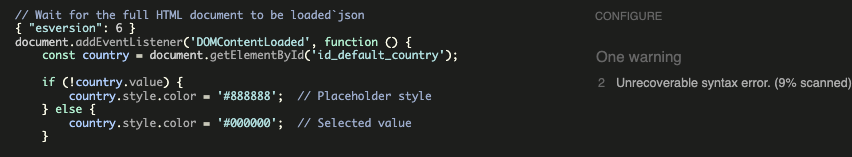
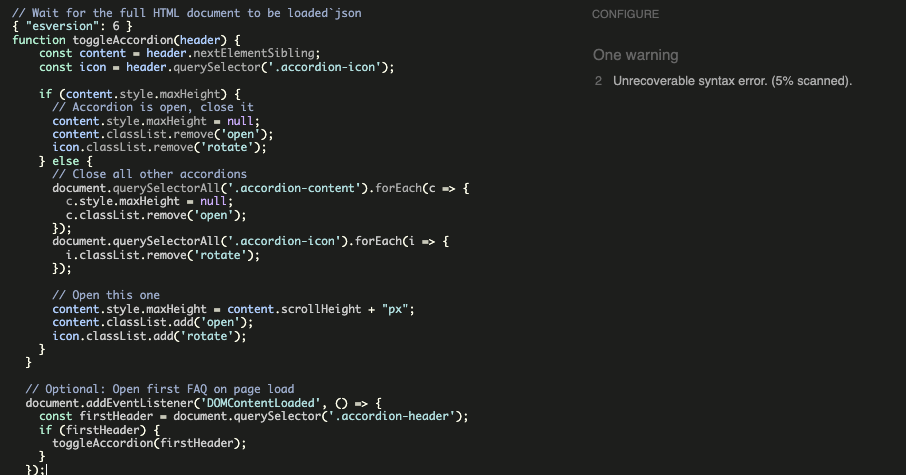
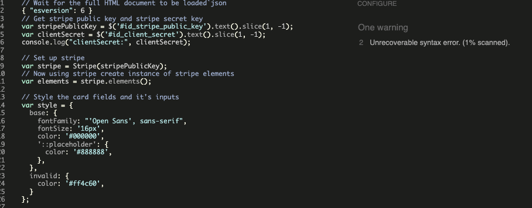

# ✅ CSS Validation Summary

This project’s CSS files have been thoroughly tested using the [W3C CSS Validator](https://jigsaw.w3.org/css-validator/) to ensure full standards compliance.

---

## 🌐 Global Styles (`:root` and Core Variables)



- ✔️ No CSS errors found  
- ✔️ CSS Level: **CSS Level 3 + SVG**  
- ✔️ Fully standards-compliant  
- ⚠️ Warnings: Dynamic CSS variables, vendor prefixes (`-webkit-`, `-moz-`), and `pointer-events: auto` (widely supported but not officially in spec)

> _“Congratulations! No Error Found. This document validates as CSS level 3 + SVG!”_

[](https://jigsaw.w3.org/css-validator/check/referer)

---

## 👤 Profiles App CSS



- ✔️ No CSS errors found  
- ✔️ CSS Level: **CSS Level 3 + SVG**  
- ⚠️ Same warnings as global styles, expected and safe

---

## 📄 Pages App CSS



- ✔️ No errors  
- ✔️ Valid CSS Level 3 + SVG  

---

## 🛒 Checkout App CSS



- ✔️ No errors  
- ✔️ Valid CSS Level 3 + SVG  

---

### CSS validation compliance:

[](https://jigsaw.w3.org/css-validator/check/referer)


## 🟨 JavaScript Linting Summary and Compatibility Notes

When running static analysis on the JavaScript files, some warnings appeared due to ES6 syntax usage in all files.


### Common Warnings Across Files

- Use of `const` and `let` (ES6 features)  
- Arrow functions (`=>`) flagged as ES6-only syntax  
- Warnings caused by linters configured for ES5 or older  

These warnings do **not** affect runtime and the code runs fine in modern browsers.

---

### qty_root.js

- Warnings on modern ES6 syntax  
- No errors  


---

### profiles.js

- Same ES6 warnings (const, let, arrow functions)  
- No errors  


---

### pages.js

- ES6-related warnings only  
- No errors  


---

### checkout.js

- ES6 warnings, no errors  


---

### Recommendation

To suppress these warnings, update your linter configuration to support ES6 by adding:

```json
{
  "esversion": 6
}
