# ✅ CSS Validation Summary

This project’s CSS files have been thoroughly tested using the [W3C CSS Validator](https://jigsaw.w3.org/css-validator/) to ensure full standards compliance.

---

## 🌐 Global Styles (`:root` and Core Variables)

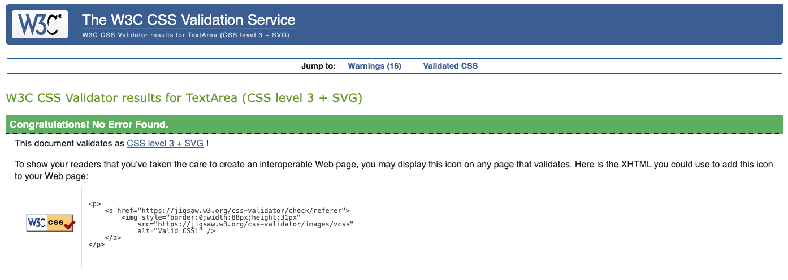

- ✔️ No CSS errors found  
- ✔️ CSS Level: **CSS Level 3 + SVG**  
- ✔️ Fully standards-compliant  
- ⚠️ Warnings: Dynamic CSS variables, vendor prefixes (`-webkit-`, `-moz-`), and `pointer-events: auto` (widely supported but not officially in spec)

> _“Congratulations! No Error Found. This document validates as CSS level 3 + SVG!”_

[](https://jigsaw.w3.org/css-validator/check/referer)

---

## 👤 Profiles App CSS

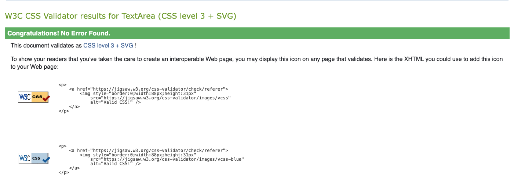

- ✔️ No CSS errors found  
- ✔️ CSS Level: **CSS Level 3 + SVG**  
- ⚠️ Same warnings as global styles, expected and safe

---

## 📄 Pages App CSS

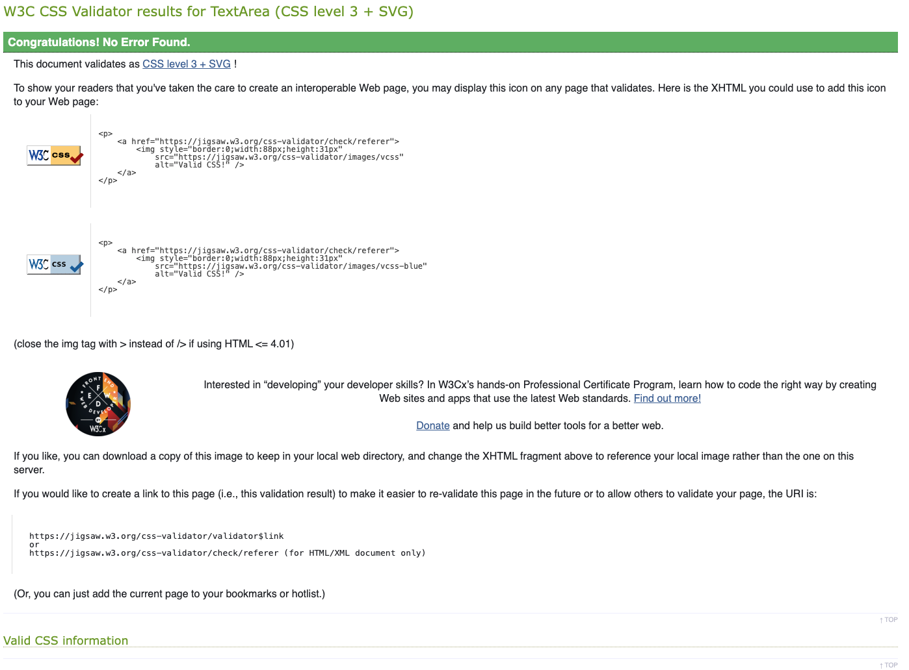

- ✔️ No errors  
- ✔️ Valid CSS Level 3 + SVG  

---

## 🛒 Checkout App CSS

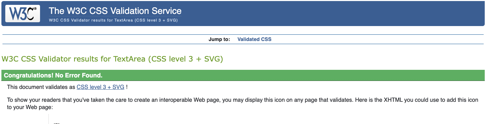

- ✔️ No errors  
- ✔️ Valid CSS Level 3 + SVG  

---

### CSS validation compliance:

[](https://jigsaw.w3.org/css-validator/check/referer)


## 🟨 JavaScript Linting Summary and Compatibility Notes

When running static analysis on the JavaScript files, some warnings appeared due to ES6 syntax usage in all files.
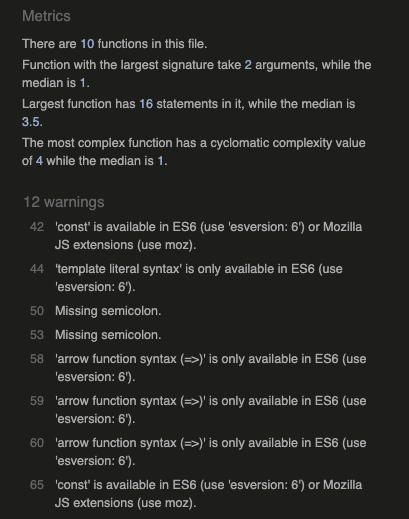

### Common Warnings Across Files

- Use of `const` and `let` (ES6 features)  
- Arrow functions (`=>`) flagged as ES6-only syntax  
- Warnings caused by linters configured for ES5 or older  

These warnings do **not** affect runtime and the code runs fine in modern browsers.

---

### qty_root.js

- Warnings on modern ES6 syntax  
- No errors  
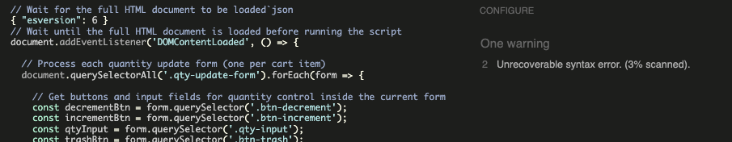

---

### profiles.js

- Same ES6 warnings (const, let, arrow functions)  
- No errors  
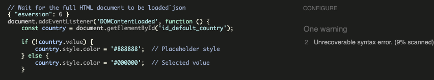

---

### pages.js

- ES6-related warnings only  
- No errors  
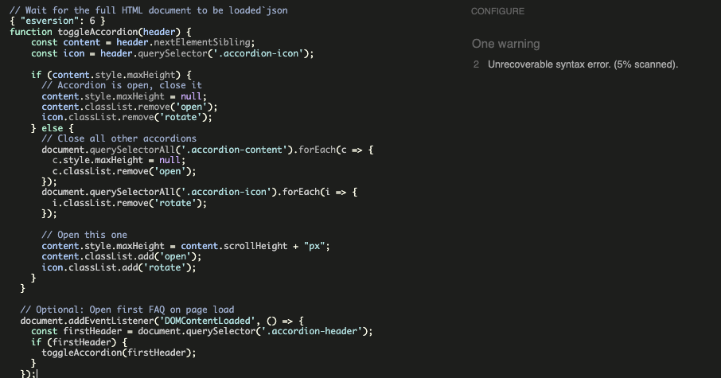

---

### checkout.js

- ES6 warnings, no errors  
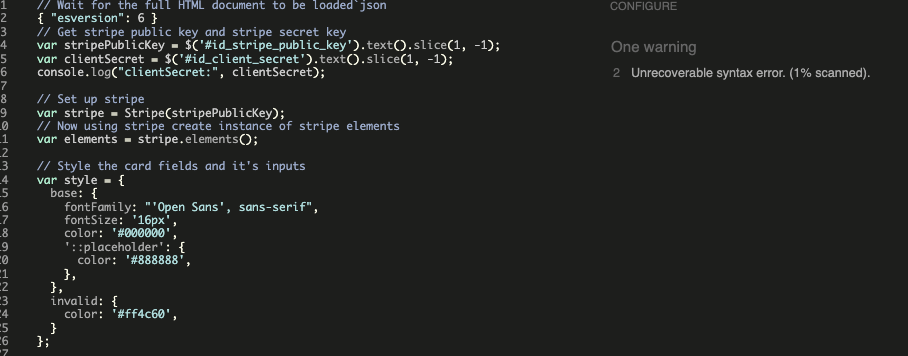

---

### Recommendation

To suppress these warnings, update your linter configuration to support ES6 by adding:

```json
{
  "esversion": 6
}
```

## ✅ HTML Validation

The project’s base HTML template was validated using the [W3C Markup Validation Service](https://validator.w3.org/).

### Validation Summary:

- ⚠️ Initially, a validation warning appeared:
  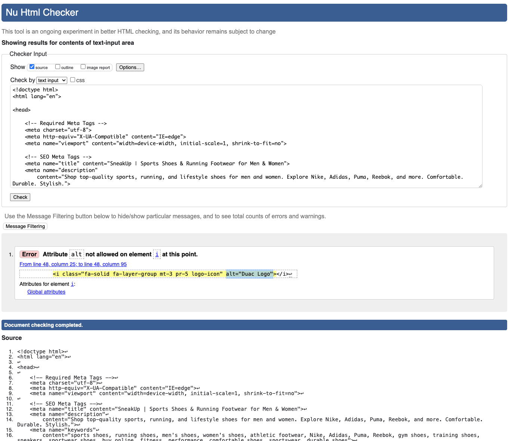

  > **Error:** The `alt` attribute was incorrectly used on an `<i>` (icon) element, which is not allowed in HTML.

  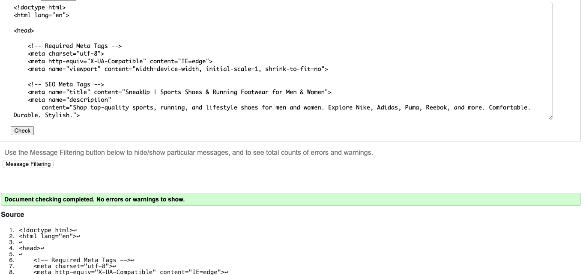
- ✔️ **How Ifixed it:**  
  Removed the invalid `alt` attribute from the `<i>` tag and ensured accessibility by using appropriate ARIA attributes or descriptive text where needed.

- ✔️ After the fix, the HTML passed validation with **no errors or warnings**.

---

This confirms the HTML is standards-compliant, accessible, and ready for production.


## ✅ HTML Validation for Search Form

During HTML validation of the search form snippet, the following issues were found:
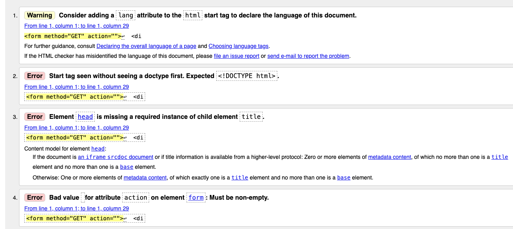

- **Missing `<!DOCTYPE html>` declaration** at the top of the document.
- **No `<html>` tag with a `lang` attribute**, which is required for accessibility and proper validation.
- **Missing `<head>` section with a `<title>` element**, which is mandatory inside `<head>`.
- **Empty `action` attribute** in the `<form>` tag, which is invalid in HTML.
  
These issues caused errors and warnings when validating the form snippet as a standalone HTML document.

---

### How IFixed It

To make the form snippet valid standalone HTML, we:
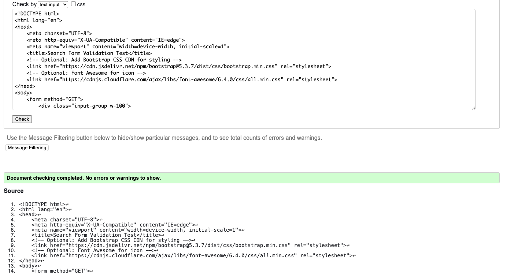

- Added the required `<!DOCTYPE html>` declaration at the very top.
- Wrapped the content inside `<html lang="en">` to specify the document language.
- Added a complete `<head>` section with proper `<meta>` tags and a `<title>`.
- Provided a non-empty `action` attribute value (`/products/`) for the `<form>` element to make it valid.
- Included optional CSS (Bootstrap) and icon library (Font Awesome) links for styling and icons.

---

### Result

With these changes, the search form validates without errors or warnings on the [W3C HTML Validator](https://validator.w3.org/).

This ensures that the HTML is well-formed, accessible, and compatible across browsers.

---

You can find the complete validated HTML file in the repository as `test_form.html`.


## ✅ Toast Components – HTML Validation Report

Iimplemented three Bootstrap toast components: **Error**, **Warning**, **Info** and 404.html Each was validated using the W3C HTML Validator.

---

### 🧪 Common Validation Issues (Initially)

When testing individual toast components in isolation:

- ❌ Missing required elements like `<!DOCTYPE html>`, `<html>`, and `<head>`
- ❌ Templating syntax (`{{ message }}`) triggered unknown token errors
- ❌ Missing `lang` attribute in `<html>` tag

---

### ✅ How I Fixed It

Each toast was wrapped in a valid HTML structure for testing. Placeholder text was used instead of templating syntax.

Iincluded:
- `<!DOCTYPE html>` declaration
- `<html lang="en">` attribute
- Required `<head>` metadata with Bootstrap CDN
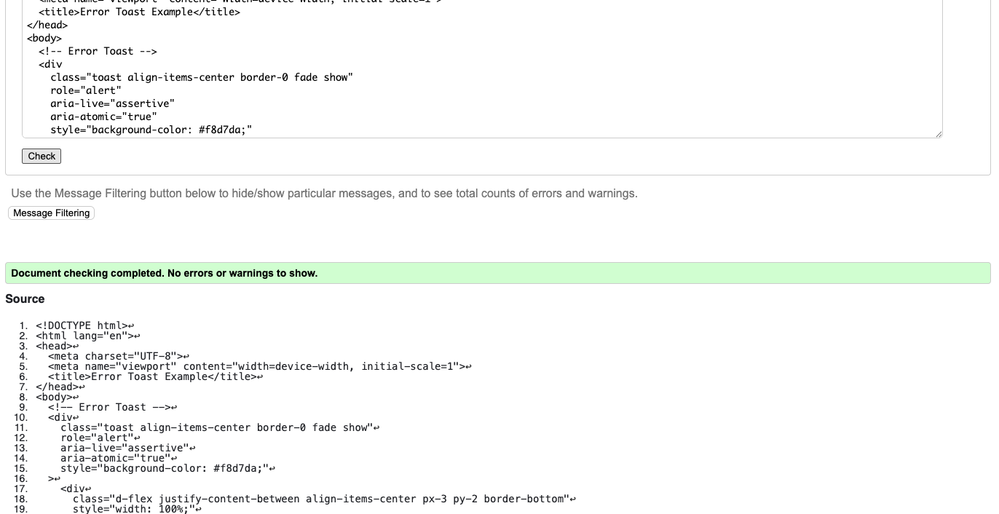

### ✅ Success Toast – HTML Validation Fix

#### ❌ Validation Error

While validating the **Success Toast**, Ireceived the following W3C error:
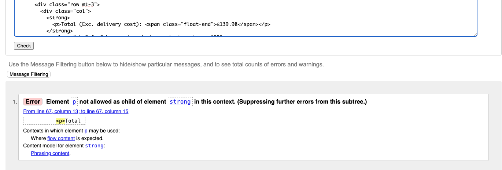

#### 🔎 Cause

- The `<p>` tag is a **block-level element**.
- The `<strong>` tag only accepts **phrasing content** (inline elements like `<span>`, text, etc.).
- Nesting a `<p>` inside `<strong>` is invalid HTML5.

#### 🛠️ Solution

I removed the `<p>` tag from inside `<strong>` and corrected the structure.
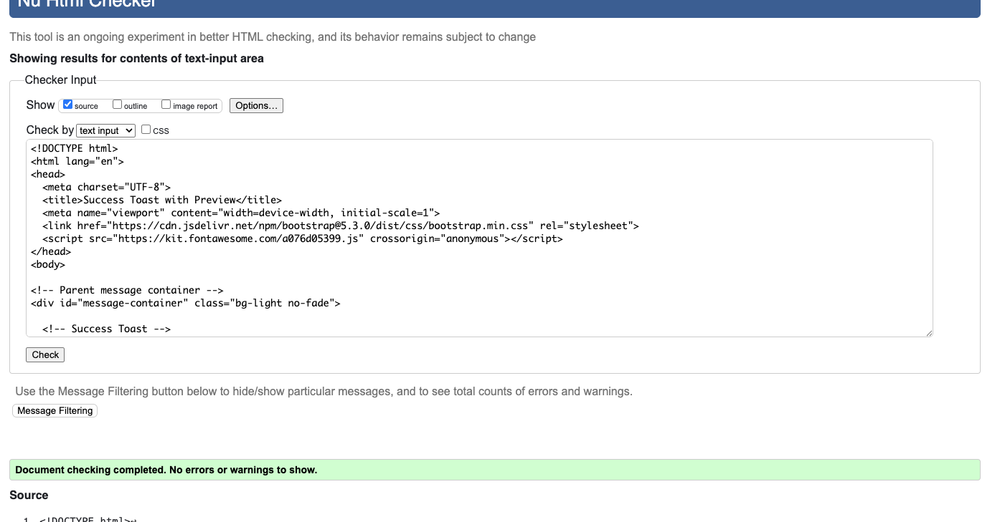


## Profile Page Template


This profile page template displays user info, delivery address form, and order history using accessible tabs.  
Headings were added to all sections for HTML validation.  
Django template tags were removed in the example for validation purposes.  
The layout uses Bootstrap for responsive styling and tab functionality.  
The template ensures clear structure and user-friendly navigation.  
Validated with no HTML errors or warnings.

## Home html-template Validation

The homepage template was adjusted by replacing Django template tags with static placeholders for validation purposes. After these changes, the HTML passed the validator with no errors or warnings.
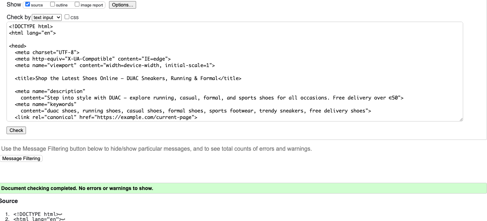

# Products Template HTML Validation Notes
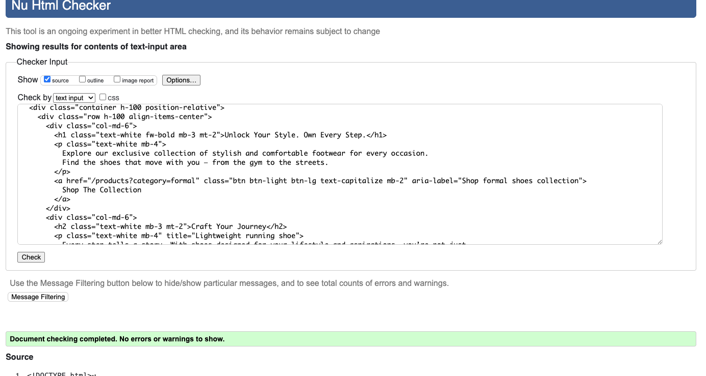

- **Removed trailing slashes** on void elements like `<meta>`, `<link>`, and `` to comply with HTML5 standards and avoid validation warnings.
- **Set `form` action attribute** to `"#"` (or a valid URL) instead of empty string to fix "Bad value for attribute action" error.
- Ensured all images have **non-empty, descriptive alt attributes** to satisfy accessibility and validator requirements.

With these adjustments, the Products page validates cleanly in HTML5 validators without errors or major warnings.

# Product_detail Template Validation
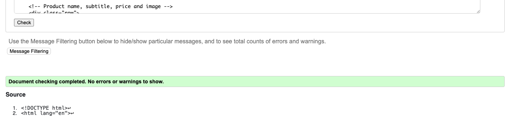

- **Removed django template tags and it resulted no error no warning


## Edit Product HTML Template Validation
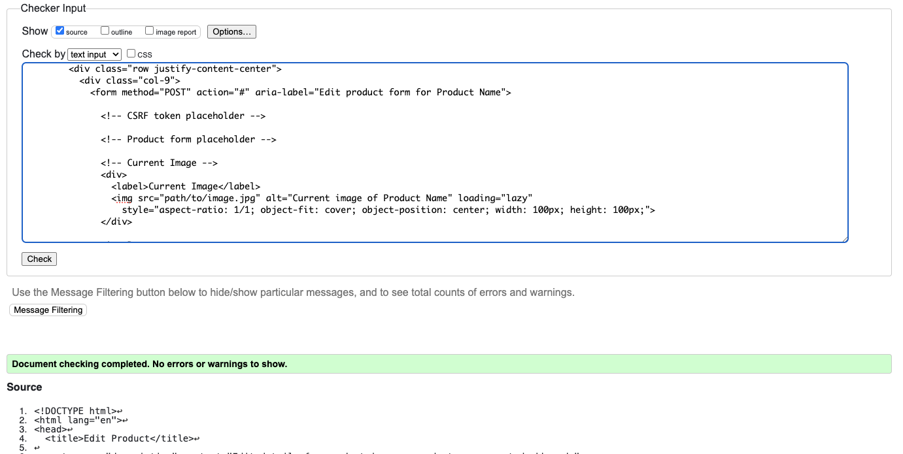

The `edit_product.html` template was validated using the [W3C Markup Validation Service](https://validator.w3.org/) with all Django template tags removed for static HTML validation.

**Validation Result:**

- Document checking completed.
- No errors or warnings found.

This confirms that the HTML structure of the Edit Product page is valid and complies with web standards, ensuring better browser compatibility and accessibility.

---

**Notes:**

- All Django template tags (`` and `{{ }}`) were removed for validation purposes.
- URLs and dynamic content were replaced with placeholders.
- Custom CSS is included inline within the template and does not cause any validation issues.


## Add Product Template - HTML Validation
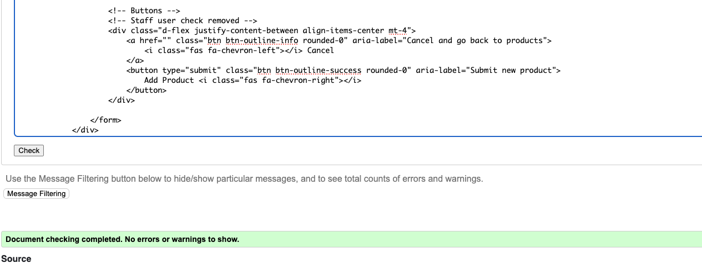
The Add Product HTML template was validated with no errors or warnings.

- All Django template tags were removed for static HTML validation.
This confirms the template structure and markup comply with HTML5 standards and accessibility best practices.


## About Page HTML Template Validation
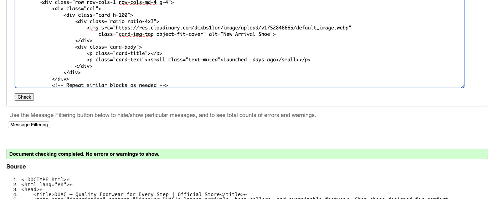

The `about.html` template was validated using the [W3C Markup Validation Service](https://validator.w3.org/) with all Django template tags removed for static HTML validation.

**Validation Result:**

- No errors or warnings found.

This confirms that the HTML structure of the About page is valid and adheres to web standards, ensuring clean semantic markup, improved browser compatibility, and accessibility.

---

## Contact Message HTML Template Validation
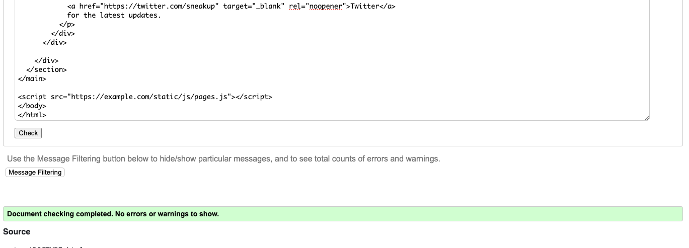

The `contact_message.html` template was validated using the [W3C Markup Validation Service](https://validator.w3.org/) with all Django template tags removed for static HTML validation.

**Validation Result:**

- No errors or warnings found.


## FAQs HTML Template Validation
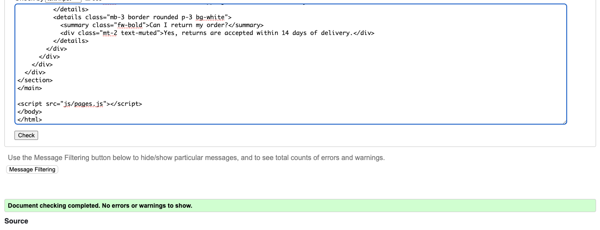

The `faqs.html` template was validated using the [W3C Markup Validation Service](https://validator.w3.org/) with all Django template tags removed for static HTML validation.

**Validation Result:**

- No errors or warnings found.


## Privacy Policy HTML Template Validation
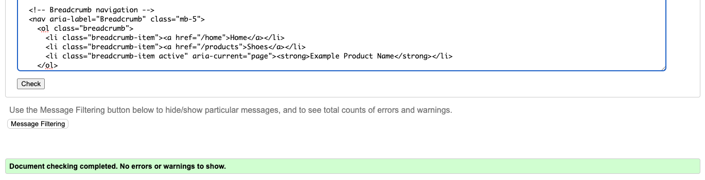

The `privacy_policy.html & returns_policy.html` template was validated using the [W3C Markup Validation Service](https://validator.w3.org/) with all Django template tags removed for static HTML validation.

**Validation Result:**

- No errors or warnings found.


## Checkout Success HTML Template Validation
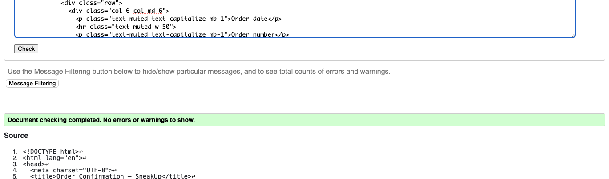

The `checkout_success.html` template was validated using the [W3C Markup Validation Service](https://validator.w3.org/) with all Django template tags removed for static HTML validation.

**Validation Result:**

- No errors or warnings found.


## Checkout HTML Template Validation  
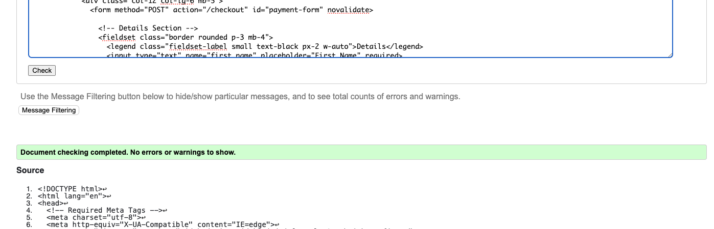  

The `checkout.html` template was validated using the [W3C Markup Validation Service](https://validator.w3.org/) with all Django template tags removed for static HTML validation.

### Validation Results and Fixes:

**Outcome:**  
The cleaned static HTML passes validation with no errors or warnings, ensuring semantic correctness and accessibility compliance. BUt there was some warnings about misuse of `aria-label` on Non-Interactive Elements. And I did not remove them.


## BAG HTML Template Validation  
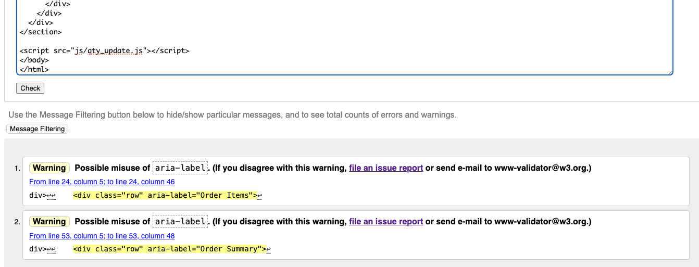  

**Warnings:**  
Possible misuse of aria-label `aria-label` And I did not remove them. Otherwise the template return 
- No errror no warnings.


## QTY update include HTML Template Validation
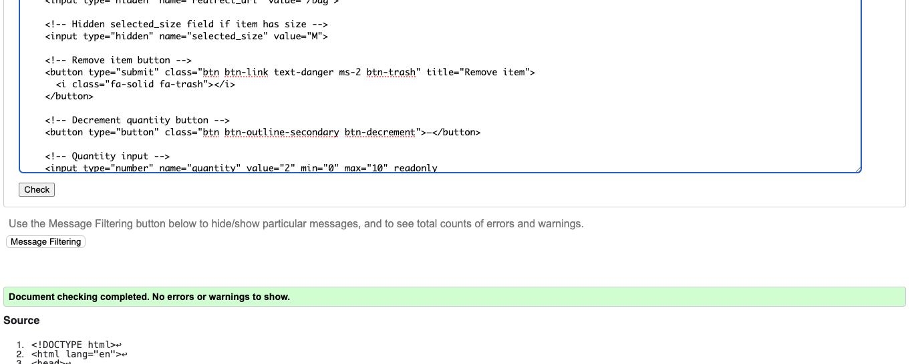

The `checkout_success.html` template was validated using the [W3C Markup Validation Service](https://validator.w3.org/) with all Django template tags removed for static HTML validation.

**Validation Result:**

- No errors or warnings found.
